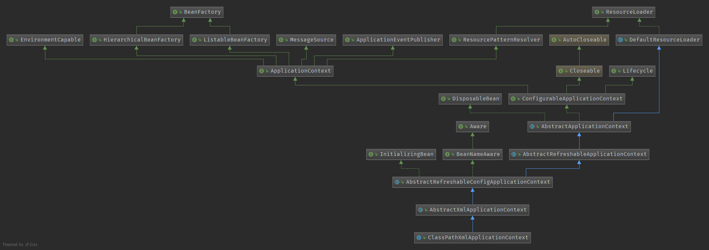
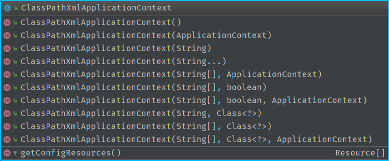

## Spring Framework
导入代码前需要执行./gradlew cglibRepackJar和./gradlew objenesisRepackJar，从最简单的context.start()开始
```java
ClassPathXmlApplicationContext context = new
    ClassPathXmlApplicationContext("classpath:application.xml");
context.start();
```

**1.ClassPathXmlApplicationContext类继承关系**



**2.ClassPathXmlApplicationContext主要方法**



