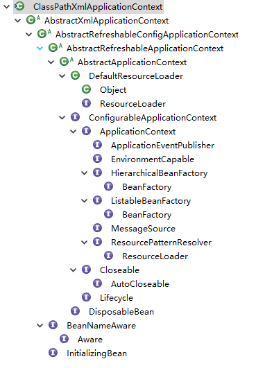
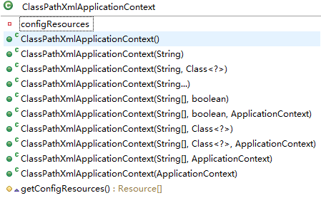

## Spring Framework
从最简单的context.start()开始
```java
ClassPathXmlApplicationContext context = new
    ClassPathXmlApplicationContext("classpath:application.xml");
context.start();
```

**1.ClassPathXmlApplicationContext类继承关系**



**2.ClassPathXmlApplicationContext主要方法**



